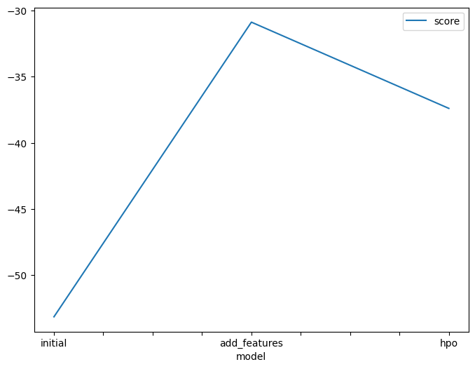

# Report: Predict Bike Sharing Demand with AutoGluon Solution
#### SASIKA AMARASINGHE

## Initial Training
### What did you realize when you tried to submit your predictions? What changes were needed to the output of the predictor to submit your results?

I got a Kaggle score of `1.80812` which is a higher value meaning that the predictions of the model are not that good. 
To reduce the Kaggle score, feature engineering and hyperparameter tuning was needed.

### What was the top ranked model that performed?

* WeightedEnsemble_L3

## Exploratory data analysis and feature creation
### What did the exploratory analysis find and how did you add additional features?

After doing EDA, we could realise that 'atemp' and 'temp' show a normal distribution. In addition to that 'windspeed','casual','registered' and 'count' which is the target values represent a biased distribution towards lower values.

`day`, `month`, `hour` were added aa separate features. 
`season` and `weather` featues were assigned as _categorial values_.

### How much better did your model perform after adding additional features and why do you think that is?

After adding additional features, the predictions got a score of `0.66995`. This is a drastic difference. 

There can be underlying patterns which affects the target values in the added new features (`day`, `month`, `hour`)

After assigning `season` and `weather` as categorical values, models can capture non-linear relationships in data.

## Hyper parameter tuning
### How much better did your model preform after trying different hyper parameters?
TODO: Add your explanation
After hyperparameter tuning, I got a Kaggle score of `0.48124`. Although this is not a drastic change with respective the value that I got after adding new features, model has shown a considerably higher performance than before.

### If you were given more time with this dataset, where do you think you would spend more time?

If I get more time with this dataset, I'll focus more on feature engineering. I believe it will affect immensely for the performance of the model because of the significant improve in the model performance it showed earlier.

### Create a table with the models you ran, the hyperparameters modified, and the kaggle score.
|model|GBM|CAT|RF|score|
|--|--|--|--|--|
|initial|Default|Default|Default|1.80812|
|add_features|Default|Default|Default|0.66995|
|hpo|learning_rate = 0.05, num_iteration = 120|learning_rate = 0.01, depth = 8|n_estimators = 120|0.48124|

### Create a line plot showing the top model score for the three (or more) training runs during the project.

### Create a line plot showing the top kaggle score for the three (or more) prediction submissions during the project.

## Summary

There was a significant performance improvement of the model after doing feature engineering.The performance of the model was further increased by hyperparameter tuning.

`WeightedEnsemble_L3` was the model that showed best performance in the intial state, after doing feature engineering to the dataset and after tuning hyperparameters of the model. 

The Kaggle score for the predictions and "Squared Mean Error"  which was the evaluation metirc of models were reduced in each state as shown in the above figure. Finally, the models performed much better than the initial states.
