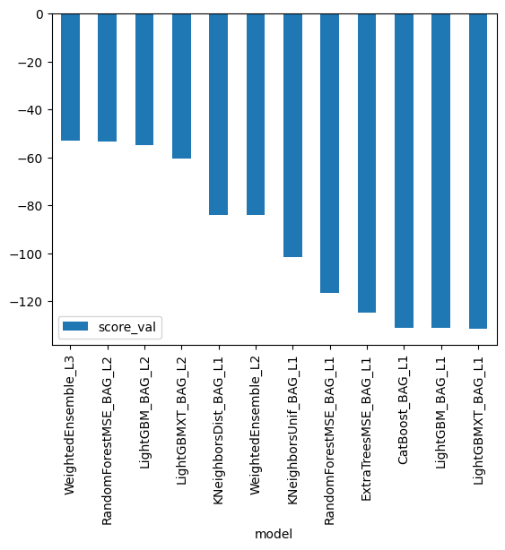
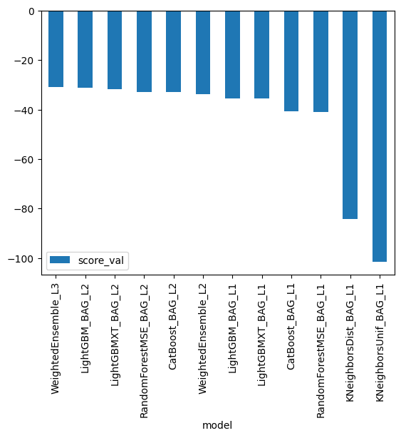
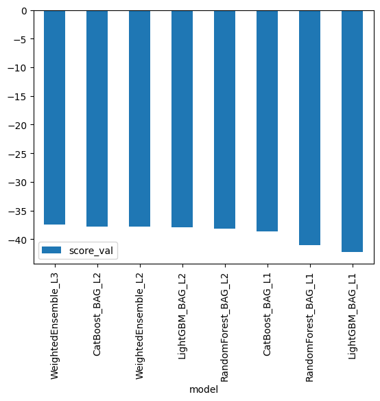
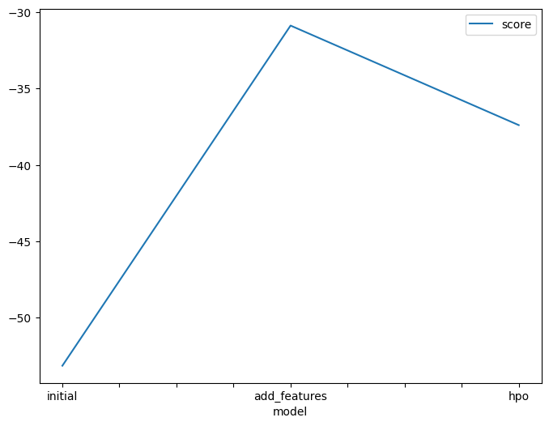
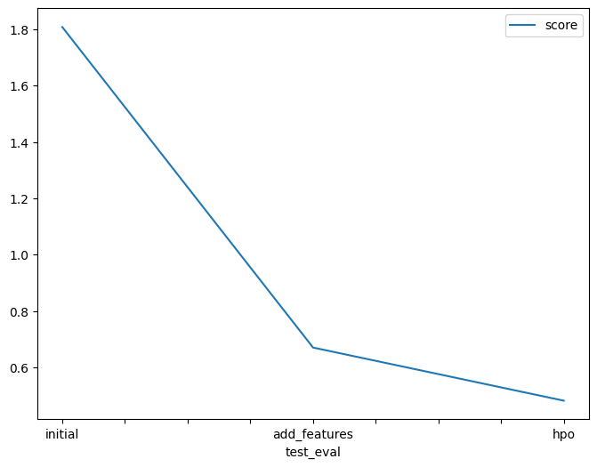
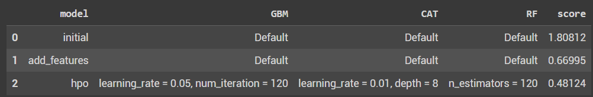

# Bike Sharing Demand Project Report

_by Sasika Amarasinghe_

____

- Here in each of these models, the evaluation metric was set as "Mean Squared Error".
- Lower the "Mean Squared Error" , higher the accuracy of the model is.

## Evaluation of models in each submission

### 1. Training models as it is

### 2. Trainig models after adding new features

### 3. Third Models after adding new features and tuning hyperparameters

- According to all the above diagrams, the best model is `WeightedEnsemble_L3` which comprises of several models. 

- In addition to that, as a whole after adding new features to the training dataset and tuning hyperparameters, the "Mean Squared Error" has been reduced in the second entry.

After doing EDA, I have been able to fit the models to the datasets more accurately reducing the evaluation metric value. 

The above chart shows that the evaluation metric score of `WeightedEnsemble_L3` model has been reduced compared to the initial model of that kind.
____

The above chart shows that the evaluation metric score of `WeightedEnsemble_L3` model on test dataset (Kaggle score) has been reduced. meaning it has performed very well after adding features and tuning hyperparameters.  

The changed hyperparameters are included in the follwoing table for GBM, CAT & RF models. 

_Tuned hyperparameters_

`GBM` - Generalized Boosted Regression Models

- learning rate was reduced, therefore converged to the slowly to the minimum point of  the curve of Cost with respecive to the weights values.
- num_iterations was increased, therfore the model will be trained more iterations.

`CAT` - CAT Boost models
- learning rate was reduced, therefore converged to the slowly to the minimum point of  the curve of Cost with respecive to the weights values.
- depth was increased, this allows the model to capture complex relationships in the trainig data. 

`RF` - Random Forest models
- n_estimators was increased, therfore the number of trees in the model and training time were increased. This leads to the less sensitive to the training data and resulting better performance of the dataset. 

_After feature engineering the Kaggle score has reduced._
* Because 'hour', 'month', 'day' features were added.
* Some features were set as categorical values.

_After tuning hyperparameters, the Kaggle score has further reduced._
* The hyperparameters were tuned, like mentioned above.

Overall, this has led to a better performance of the models.